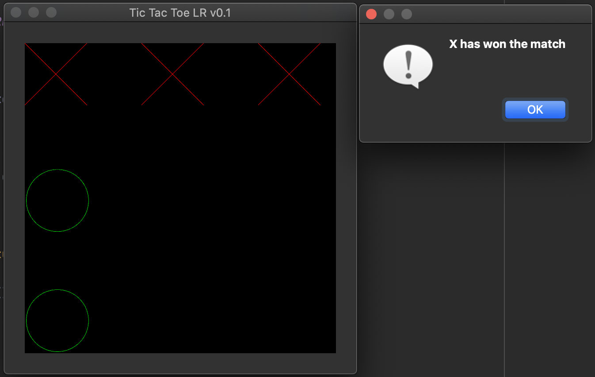

# Tic Tac Toe LR

This is a simple Tic Tac Toe game written in C++ with QT and OpenGL.

## How to build

This project is configured to use CMake. In order to build this project you'll need to follow these steps:

1. Create a *build* directory
2. CD into your build directory
3. Execute *cmake-gui ../*
4. Set the *Qt5Widgets_DIR* to the location of your Qt5 Widgets directory on you hard disk (ex. /Users/example/Qt/5.10.1/clang_64/lib/cmake/Qt5Gui)
5. Configure and Generate the build files
6. make

## Authors

The authors of this simple game are:

* Raydelto Hernandez (raydelto@yahoo.com)
* Leo Javier

## Screenshot

